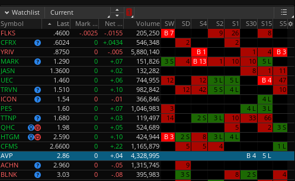
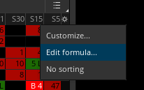
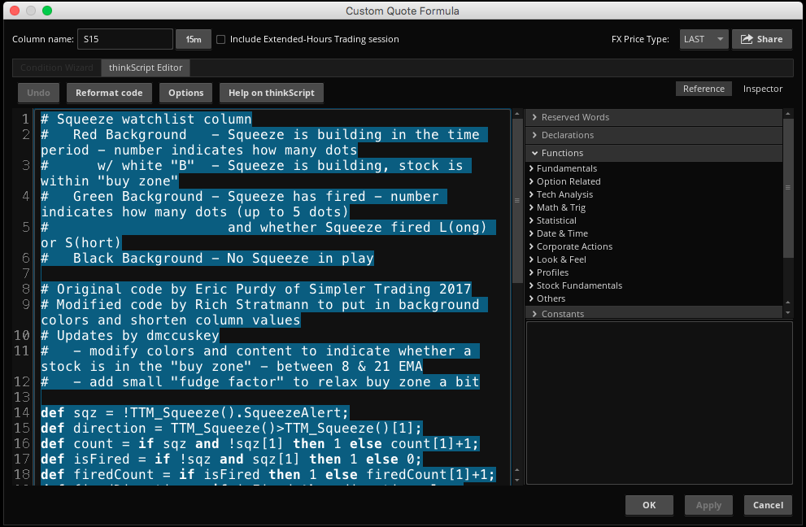
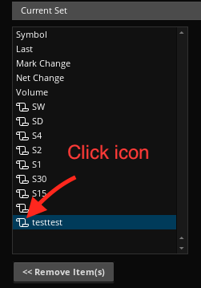
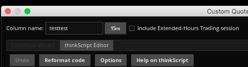

# TTM Squeeze watchlist column indicator

This script can be added to new or existing watchlist columns to indicate the status of the TTM Squeeze for a particular time-frame.

It also indicates whether a symbol is in the Buy Zone by highlighting the background color and adding a "B" to the column. The Buy Zone is defined as in between the 8 & 21 EMA.

ToS share code: http://tos.mx/IPrEhH

Here is what each means:

Background | Meaning
---|---
Bright Red | **_The stock price is in the Buy Zone._**
Muted Red | **_The squeeze is building in this time period._** The number shows the number of dots on the TTM Squeeze indicator.
Muted Green | **_The squeeze has fired._** The number shows how many dots (up to 5) and whether the squeeze fired L(ong) or S(hort).
Black | _There is no squeeze in play._

## Installation

You can either *update* an existing column or create a new column.

### Update an existing column

**1. Copy code**

First we will copy the code so it can be pasted into ThinkOrSwim.

Click on the script file above (`ttms-watchlist-column.ts`). On the next page click on the RAW button. Select all of the text and copy it.

**2. Update watchlist column**

Right click on the column header to get the dropdown and select *Edit Formula...*. The *ThinkScript Editor* dialog will appear.

In the thinkScript editor box, select all of the current content and paste the new code into the box.

Click on the OK button.

Repeat these steps for all of the existing columns.

### Add script to a new column

1. in ToS, go to *Setup > Open Shared Item...*

    The Open Shared Item dialog will appear

2. Paste in the above Share Code into the dialog and click Preview. Then click Open.

    The Shared ThinkScript Quote Saved dialog will appear.

3. Rename the script to something which can be found easily, like `testtest`.

    We will update the name later.

    *At this point the script is saved in ToS and can be added to a column.*

4. On *any* column in the watchlist, right-click the header and select *Customize...*.

    

    This will open up the Watchlist dialog.

5. In the input box labeled *Lookup a column...* type in the name you chose in step 3, eg `testtest`.

6. Double-click on the name in the left hand column to add it to the right side.

7. In the right-hand column, click on the *script* icon to the left of the name.

    

    This will open a *Custom Quote Formula* dialog where you will choose the name and time-frame you want for the column.

8. In upper left of the *Custom Quote Formula* dialog, edit the name and time-frame.

    

    Here we change the name to *S15* and time-frame to 15 minutes. Be sure to uncheck *Include extended-hours trading session*.

    

    Click OK on the *Custom Quote Formula* dialog.

    Then click OK on the Watchlist Customize dialog.

*Repeat steps 1-8 for each new column that you wish to add.*

# Acknowledgements

Original code by Eric Purdy and Rich Stratmann

There was no license on the original code, so I have placed the new updates under the MIT license.
